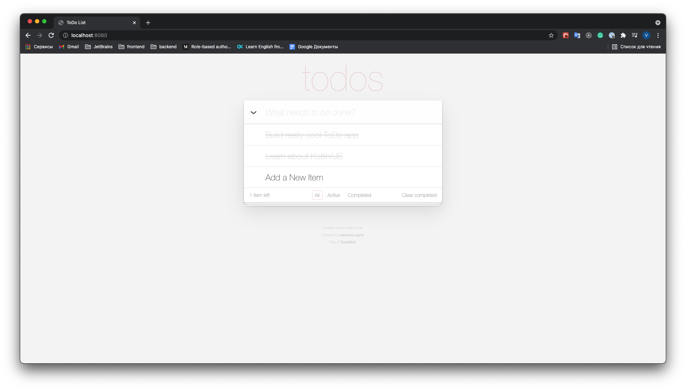

# full-stack-spring-collaborative-todo-list-sample

Fork of [https://github.com/OlegDokuka/collaborative-todo-list](https://github.com/OlegDokuka/collaborative-todo-list)

A full-stack demo application written with `Kotlin/JS` and `Spring`

## **Run application**

- Open project in Intellij IDEA
- Run `DemoApplication` configuration

## **Description**

This application is an example of ToDo list application for collaborative work.

It is a [Kotlin Multiplatform](https://kotlinlang.org/docs/reference/multiplatform.html) project.

It uses:

- `kotlin-multiplatform`, with two targets `js` and `jvm`;
- Spring framework for backend;
- [Kotlin/JS](https://kotlinlang.org/docs/js-overview.html) with React framework for frontend;
- RSocket